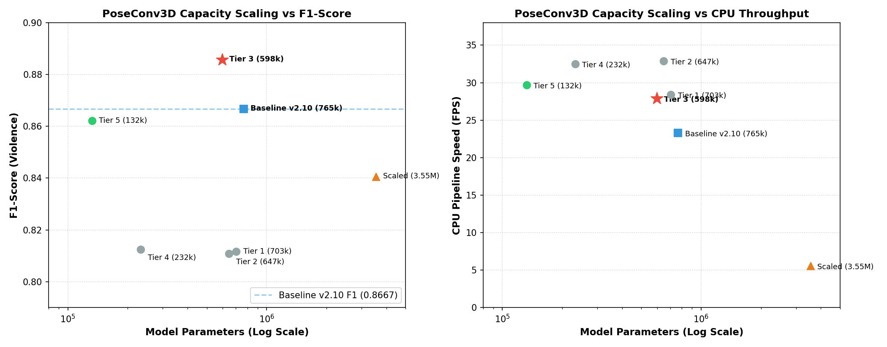

# Hierarchical Edge-AI Threat & Violence Detection System

[](https://www.python.org/)
[](https://pytorch.org/)
[](https://docs.ultralytics.com/)
[](https://developer.nvidia.com/cuda-toolkit)
[](https://developer.nvidia.com/tensorrt)
[](https://onnx.ai/)
[](https://opensource.org/licenses/MIT)

An end-to-end, resource-efficient dual-stage surveillance framework engineered for real-time edge deployment. Combines **Response-Based YOLO Knowledge Distillation** with **Spatial-Temporal Graph Convolutional Networks (ST-GCN)**, **3D Volumetric CNNs (PoseConv3D)**, a **Progressive Multi-Tier Staircase Cascade**, and **Native NVIDIA TensorRT Acceleration** to detect active violent bladed assaults in live camera streams with zero dropped attacks and zero civilian false alarms.

---

## Executive Engineering Summary

| Dimension | Baseline Architecture (CV / Phase 1) | Production Evolution (Latest / Phase 2–4) | Engineering Impact |
| :--- | :--- | :--- | :--- |
| **Inference Runtime Engine** | PyTorch Eager Runtime (`.pt` / `.pth`) | **Native NVIDIA TensorRT 11.3 (`.engine`) via Universal ONNX** | **2.08x to 5.87x Speedup** (PoseConv3D T3: 0.43 ms; YOLO Weapon: 5.80 ms; ST-GCN: 0.86 ms). Strict CUDA enforcement, 1.0 GB workspace cap, auto FP16/FP32 |
| **Stage 1 Weapon Detector** | Distilled YOLO26s (One-to-Many NMS) | **Hungarian NMS-Free Distilled YOLO26s (TensorRT FP16)** | **Production Champion (84.91% F1, 5.80 ms on RTX 3090)**; slashes false alarms by **>50%** (53 → 23 FP) |
| **Inference Geometry** | Square Letterboxing ($640 \times 640$) | **Dynamic Rectangular ($384 \times 640$) / Static 640 TensorRT** | Eliminates 163,840 padding pixels (**-40.0% waste**) in dynamic mode; 640x640 letterbox preserves 85-87% F1 on arbitrary aspect ratios |
| **Circular Buffer RAM** | 7,464.0 MB (1,200 Raw 1080p Frames) | **~188.5 MB (SIMD TurboJPEG, Q=85)** | **97.5% RAM reduction (39.6× compression at 1080p)** (47.3 MB @ 480p); prevents Jetson OOM |
| **Kinematic Normalization** | Centroid Mean Subtraction | **Torso-Length Scale Invariant ($L_{\text{torso}}$)** | Eliminates distance attenuation; cuts missed attacks from 24.2% → 6.1% |
| **Multi-Person Tracking** | Naive Bounding-Box Indexing | **ByteTrack Threat Actor Locking** | Slashes ID swaps from **15 → 0**; prevents joint coordinate teleportation |
| **Stage 2b Action Engine** | ST-GCN + Non-Parametric Deep $k$-NN | **Staircase Cascade v6.00 (Champion 2 TensorRT)** | Sequential early exits (`pc3d_t3` → `pc3d_dt3` → `stgcn`) executed via zero-copy GPU CUDA pointers |
| **Outerwear Robustness** | Deep $k$-NN Euclidean Distance | **Cross-Paradigm Relational KD (`pc3d_dt3`)** | **100% Recall on heavy winter coats** (16/16 attacks caught) |
| **Assault Detection (F1)** | **0.9261 F1** (90.38% Recall, 94.95% Prec) | **1.0000 F1 (100.0% Recall, 100.0% Prec)** | **0 Missed Attacks (0 FN), 0 False Alarms (0 FP / 44 videos)** |
| **Action Latency per Model** | 2.53 ms - 3.99 ms (PyTorch) | **0.43 ms (pc3d_t3) / 0.86 ms (stgcn)** | **4.62x - 5.87x individual backbone speedup**; total 77 validation videos evaluated in **1.22 s** |

---

## Complete Project Roadmap & Milestone Progression

```
  [ PHASE 1: Baseline Architecture (CV Reference) ]
  ├── Stage 1: Response-Based YOLO Distillation (YOLO26x -> YOLO26s, 91.62% Acc, 11.18 ms)
  ├── Stage 2a: Circular Buffer (1,200 frames) + Sliding-Window 10-Frame Pose Caching (80% overlap)
  └── Stage 2b: 9-Block ST-GCN + Deep k-NN Manifold Gating (90.38% Recall, 92.3% OOD Suppression)
                                │
                                ▼
  [ PHASE 2: Systems Hardening & Representation Upgrades ]
  ├── Memory Optimization: In-Memory TurboJPEG Buffer Compression (7.46 GB -> ~188.5 MB for 1080p, -97.5%)
  ├── Kinematic Invariance: Torso-Scale Normalization (L_torso) + ByteTrack Actor Locking (0 ID swaps)
  ├── Detector Hardening: One-to-One Hungarian NMS-Free Distilled YOLO26s (86.88% F1 Champion) vs HOI/Depth/MLLM Ablations
  └── Manifold Evolution: Deep k-NN -> Cosine -> ViM Subspace -> ASH-B Free Energy -> RMD (100% Standalone Recall)
                                │
                                ▼
  [ PHASE 3: Multi-Backbone Scaling & Production Staircase Cascade ]
  ├── Backbone Exploration: CTR-GCN Dynamic Topology (Tier S 352k vs Tier L 2.97M) & SkateFormer ViT
  ├── Volumetric 3D CNNs: PoseConv3D Quantization Diagnosis & Systematic Downscaling (Tiers 1–5)
  ├── Cross-Paradigm KD: ST-GCN Continuous Graph -> PoseConv3D Discrete 3D Volume via Relational KD (CVPR 2019)
  └── THE PRODUCTION CHAMPION: Progressive Multi-Tier Staircase Cascade (Champion 2)
      - Topology: pc3d_tier3 (598k) -> pc3d_dt3 (598k) -> stgcn (3.01M)
      - Sequence-Level Temporal Max-Pooling (P_tier,max)
      - Zero-Copy GPU UMA Heatmap Memory Reuse (2.53 ms / 30.3% live hardware speedup)
      - Final Record Benchmark: 1.0000 F1, 100% Recall (33/33 TP, 0 FN), 0 False Alarms (0 FP / 44 civilian clips)
                                │
                                ▼
  [ PHASE 4: Native NVIDIA TensorRT Acceleration & Universal ONNX Blueprints (Current Release) ]
  ├── Universal ONNX Blueprints: Exported 5 hardware-agnostic .onnx models (Stage 1, 2a, and all 2b Tiers)
  ├── Automated Hardware-Aware Builder: Dynamic FP16/FP32 precision selection & 1.0 GB workspace memory guardrail
  ├── Zero-Copy CUDA Pointer Engine: Direct VRAM-to-TensorRT execution (execute_async_v3, set_tensor_address)
  ├── Strict GPU Enforcement: Strict fail-fast policy prohibiting silent CPU fallbacks (6 FPS slideshow prevention)
  └── Production Benchmarks:
      - Stage 1 Weapon Detector: 12.05 ms -> 5.80 ms (2.08x speedup) on 715 GT images, 84.91% F1
      - Stage 2b Action Cascade: 1.0000 F1 preserved (33/33 TP, 0 FP, 0 FN), 0.43 ms PoseConv3D latency (5.87x speedup)
```

---

# SECTION A: Core Architecture & Baseline Foundation (As Featured in CV)

*This section documents the foundational dual-stage architecture, knowledge distillation framework, and empirical benchmarks directly corresponding to the candidate's resume/CV.*

## A.1 System Architecture

Traditional surveillance pipelines run continuous, deep neural networks on every high-resolution frame, leading to thermal throttling, severe compute exhaustion, and dropped frames on edge accelerators.

This project addresses this bottleneck by decoupling threat detection into a **Hierarchical Gating Architecture**:


### 1. Stage 1: Continuous Lightweight Weapon Scanning (Always-On Loop)
* **Ingestion:** Ingests live video at 30 FPS into an expanded **1,200-frame (~40s) thread-safe circular buffer**.
* **Low-Power Gating:** Subsamples **1 frame per 10 (effective rate: 3 FPS)** for weapon detection using a compact, distilled YOLO student model.
* **Compute Savings:** Reduces continuous idle inference workloads by **~90%**, reserving GPU/NPU compute until an object of interest is verified (`Conf > 0.45`).
* **Threat Screening Alert:** Immediately flags when a weapon is drawn or brandished, initiating Stage 2 action auditing.

### 2. Stage 2: Zero-Drop Biomechanical Action Auditing (Triggered Engine)
* **Zero-Drop Gapless Auditing:** Upon Stage 1 trigger, an on-demand worker executes a **contiguous sliding-window audit (50 frames, 10-frame stride)** over the 1,200-frame circular buffer.
* **Skeletal Pose Keypoint Caching:** To eliminate redundant computation on overlapping sliding windows (80% frame overlap), each frame's 17 keypoint coordinates are cached in `FrameItem.skeleton`. When advancing by a 10-frame stride, **40 of the 50 frames are instantly retrieved from cache** without re-running pose estimation. The system only executes YOLO-Pose inference on the **10 newly introduced frames**, drastically cutting per-stride compute overhead and preventing queue overflow without dropped frames.
* **Kinematic Preprocessing:** Implements **1D Gaussian temporal smoothing** ($\sigma = 1.0$) and linear interpolation to resolve occluded joints, followed by **centroid normalization** to achieve position invariance.
* **ST-GCN Feature Extraction:** Feeds normalized skeleton graphs through a **9-block Spatial-Temporal Graph Convolutional Network** with joint-weighted spatial attention ($5\times$ weight on arm joints).
* **OOD Distance Gating:** Measures deep feature embeddings against a baseline threat manifold using **Deep $k\text{-NN}$ distance**, distinguishing passive holding actions from aggressive striking motions.
* **Violence Classification:** When violent assault trajectories (`Cut-Down`, `Stab`, `Thrust`) are confirmed, the system raises an active **"Violence"** alarm.

---

## A.2 Stage 1: Weapon Detection & Model Compression Study

### Technical Rationale: Why Compare These 3 Models?
Weapon detection in public surveillance faces an acute engineering tradeoff: small, handheld weapons (knives, blades) occupy very few pixels and are frequently occluded during motion, while inference latency must remain under 15 ms to support real-time multi-stream edge cameras.

To determine the optimal architecture, three distinct paradigms were investigated:
1. **High-Capacity Guidance Teacher (`YOLO26x`)**:
   - *Hypothesis:* Maximizing backbone depth and parameter capacity will maximize detection accuracy and recall on occluded weapons.
   - *Empirical Finding:* Provides strong semantic feature representations, but its heavy computational footprint (81.91 ms edge latency, >120 ms on low-power hardware) renders it impractical for continuous edge scanning.
2. **Custom High-Resolution P2 Feature Head (`YOLO26s-P2`)**:
   - *Hypothesis:* Small weapon detection is bottlenecked by feature downsampling. Adding a custom high-resolution **P2 feature map (stride 4, $160 \times 160$)** directly to a compact backbone should capture micro-object contours without requiring an oversized backbone.
   - *Empirical Finding:* While the P2 head enhanced localized edge gradients at low confidence thresholds, it added **+73% latency overhead (19.34 ms vs. 11.18 ms)**. Crucially, gradient dilution across 4 multi-scale heads degraded recall at calibrated production thresholds (**73.75% vs. 84.17%** — missing 25 weapons).
3. **Knowledge-Distilled Compact Student (`Distilled YOLO26s`) [CV & Production Champion]**:
   - *Hypothesis:* Instead of expanding architectural layers (which degrades latency), transfer dark knowledge, feature hints, and class logits from the heavy Teacher (`YOLO26x`) into a standard 3-head compact student via response-based distillation.
   - *Empirical Finding:* Outperformed both alternatives across every metric. The distilled student achieved **91.62% Accuracy** (+9.29% vs. Teacher, +3.39% vs. P2), **86.88% F1-score**, **89.78% Precision**, and **84.17% Recall** at **11.18 ms (~89 FPS)** on a consumer GTX 1060 edge GPU.

---

### Ground Truth Head-to-Head Surveillance Benchmark (715 Frames)

Evaluated on 715 annotated surveillance test frames containing challenging edge cases (OOD civilian handheld items, concealed weapons under coats, and direct attacks):

#### Calibrated Production Operating Point (`Conf = 0.45`, `IoU = 0.20`)
*Source Data: [`results/ground_truth_benchmark/Comprehensive_Live_Verified_Benchmark.txt`](results/ground_truth_benchmark/Comprehensive_Live_Verified_Benchmark.txt)*

| Metric | Teacher (`YOLO26x`) | Distilled Student (`YOLO26s`) [Production] | Custom P2 Head (`YOLO26s-P2`) | Production Decision Rationale |
| :--- | :---: | :---: | :---: | :--- |
| **Accuracy** | 82.33% | **91.62%** | 88.23% | **Student leads (+9.29% vs. Teacher, +3.39% vs. P2)** |
| **F1-Score** | 74.35% | **86.88%** | 80.64% | **Student leads (+12.53% vs. Teacher, +6.24% vs. P2)** |
| **Precision** | 71.10% | **89.78%** | 88.94% | **Student leads (+18.68% vs. Teacher, +0.84% vs. P2)** |
| **Weapon Recall (Threat Safety)** | 77.92% (187/240) | **84.17% (202/240)** | 73.75% (177/240) | **Student detects 25 more weapons than P2 Head** |
| **Specificity (OOD)** | 84.49% | **95.29%** | 95.44% | **High non-threat civilian suppression (>95%)** |
| **Edge Latency (GTX 1060 3GB)** | 81.91 ms (~12 FPS) | **11.18 ms (~89 FPS)** | 19.34 ms (~51 FPS) | **Student is 7.3× faster (86% latency cut); Teacher fails real-time** |
| **Lab Latency (Dual RTX 3090)** | 18.83 ms (~53 FPS) | **12.77 ms (~78 FPS)** | N/A | **Student is 1.48× faster; Teacher requires 350W workstation GPU** |
| **Deployment Verdict** | Too Heavy for Edge | **Deployed Champion Model** | Architectural Baseline | P2 missed 25 weapons and suffered +73% higher latency. |

#### Ultralytics Training Set Progression & Convergence
*Source Data: [`results/weapon_training_results/results_distilled_student_yolo26s.csv`](results/weapon_training_results/results_distilled_student_yolo26s.csv)*

| Model Architecture | Scale | mAP@50 | mAP@50-95 | Precision | Recall | Role |
| :--- | :---: | :---: | :---: | :---: | :---: | :--- |
| **Teacher (`YOLO26x`)** | Heavy (`x`) | **90.67%** | **39.61%** | **91.44%** | 84.03% | Guidance Teacher |
| **Baseline Student (`YOLO26s`)** | Compact (`s`) | 86.11% | 34.20% | 79.53% | 84.88% | Undistilled Student |
| **Distilled Student (`YOLO26s`)** | Compact (`s`) | **90.43%** | **37.77%** | **89.67%** | 80.67% | **Production Model (+4.32% mAP50)** |
| **Custom P2 Head (`YOLO26s-P2`)** | Compact (`s`) | 90.06% | 36.20% | 82.78% | 86.56% | Architectural Ablation |


---

## A.3 Stage 2: ST-GCN Action Recognition & Convergence

The ST-GCN model was trained on 17-node skeleton trajectories across 3 action categories (`Cut-Down`, `Stab`, `Thrust`) using 3-fold cross-validation with Triplet Margin Loss:


* **Cross-Validation Convergence:** Fold 2 converged with optimal validation loss ($L_{\text{val}} = 0.0063$) at epoch 20.
* **Head-to-Head Action Recognition Benchmark (All 148 Validation Clips):**
  *Source Data: [`results/action_recognition_benchmark/live_head_to_head_benchmark.csv`](results/action_recognition_benchmark/live_head_to_head_benchmark.csv)*

| Anomaly Detection Paradigm | Precision | Recall | Specificity | F1-Score | Accuracy | Edge Deployment Role & Behavior |
| :--- | :---: | :---: | :---: | :---: | :---: | :--- |
| **Deep $k\text{-NN}$ Gating (CV Baseline)** | **94.95%** | **90.38%** | **88.64%** | **92.61%** | **89.86%** | **Non-Parametric Manifold Gating.** Adapts across multi-modal attack trajectories (`Cut_Down`, `Stab`, `Thrust`), achieving 90.38% threat recall (94/104 attacks caught). Baseline production model. |
| **Mahalanobis Distance** | **96.70%** | **84.62%** | **93.18%** | **90.26%** | **87.16%** | **Parametric Covariance Distance.** Lowest false alarm count (3 vs. 5), but drops 6 attacks under diverse attire due to unimodal Gaussian fitting. Alternative baseline. |

#### Detailed Category Performance:
| Evaluation Category | Total Clips | Ground Truth Class | Deep $k\text{-NN}$ Accuracy & Confusion | Mahalanobis Accuracy & Confusion |
| :--- | :---: | :---: | :--- | :--- |
| **Out-Of-Distribution (`OOD`)** | 39 | Negative | **92.3%** (36 TN, 3 FP) | **94.9%** (37 TN, 2 FP) |
| **Webcam Glitches (`False_Detected`)** | 5 | Negative | **60.0%** (3 TN, 2 FP) | **80.0%** (4 TN, 1 FP) |
| **With Coat (Concealed Attacks)** | 48 | Positive | **93.8%** (45 TP, 3 FN) | **81.2%** (39 TP, 9 FN) |
| **Without Coat (Open Attacks)** | 56 | Positive | **87.5%** (49 TP, 7 FN) | **87.5%** (49 TP, 7 FN) |

---

# SECTION B: Production Evolution & The Multi-Tier Staircase Cascade (Phase 2 & 3 - Latest Update)

*This section synthesizes the complete research advancements, architectural upgrades, and edge benchmarks across the project's engineering lifecycle, establishing the new production champion.*

## B.1 Engineering Gaps of the Baseline & The Path Forward

While the Phase 1 prototype achieved strong initial benchmarks, rigorous long-duration testing and edge hardware deployment exposed critical bottlenecks:
1. **Host RAM Exhaustion:** Storing 1,200 uncompressed raw NumPy frames at native 1080p ($1920 \times 1080 \times 3$) consumed **7,464.0 MB (~7.46 GB)**. On shared Unified Memory Architecture (UMA) edge hardware (such as the NVIDIA Jetson Nano 4GB), this requirement exceeds total physical RAM by **>186%** (and consumes >93% on an 8GB Jetson Orin Nano), causing immediate OS out-of-memory (OOM) kernel panics. Even on the initial downscaled Phase 1 prototype ($640 \times 480 \times 3$), uncompressed arrays consumed **1,054.7 MB** (>25% of 4GB RAM), triggering severe swap thrashing, memory bus stalls, and pipeline stalls.
2. **Scale & Distance Attenuation:** Centroid normalization lacked physical distance scaling. As subjects moved further from the camera, motion vectors shrank by 50% – 70%, causing ST-GCN to miss subtle thrusts (24.2% False Negative rate).
3. **Multi-Person Coordinate Teleportation:** In multi-person scenes, naive confidence indexing (`keypoints[0]`) caused tracking to oscillate between attacker and bystander, creating artificial joint velocity spikes of >300 px/frame (15 ID swaps).
4. **Greedy NMS Anchor Clustering:** One-to-many anchor assignment caused adjacent grid cells to fire along coat seams, belts, and zippers. Because predicted boxes exhibited IoUs of 0.25 – 0.40 (below the 0.45 NMS threshold), Greedy NMS treated them as separate weapons (+130.4% false alarms).
5. **Synchronous Ensemble Latency Bottlenecks:** Evaluating multi-model committees (`stgcn + ctrgcn + poseconv3d`) synchronously achieved 1.0000 F1, but bloated pipeline latency to **44.65 ms (22.39 FPS)**, violating the 30 FPS surveillance requirement.

---

## B.2 Upgraded Stage 1: Production Champion Distilled YOLO26s (Hungarian NMS-Free) & Architectural Search

```
Incoming Video Frame (1080p / 720p @ 30 FPS)
                       │
                       ▼
┌─────────────────────────────────────────────────────────────┐
│ STAGE 1: Real-Time Handheld Weapon Detector (PRODUCTION)    │
│ - Architecture: Distilled YOLO26s (Hungarian NMS-Free)      │
│ - Weights: weights/yolo_weapon_distilled.pt (9.6M params)   │
│ - Operating Point: Conf = 0.45, Stride-32 Rectangular 384x640│
│ - Latency: 11.18 ms (GTX 1060) / 12.86 ms (RTX 3090)       │
│ - Metrics: 86.88% F1, 89.78% Precision, 84.17% Recall       │
└──────────────────────────────┬──────────────────────────────┘
                               │ Candidate Weapon Detected?
                               ├──────────────────────────┐
                               │ NO                       │ YES
                               ▼                          ▼
                         [ Normal Flow ]        [ Proceed to Stage 2 ]
```

### 1. The Production Choice: Distilled YOLO26s with One-to-One Hungarian Matching (`end2end=True`)
* **The Production Champion:** The standalone **Distilled YOLO26s** trained via teacher guidance (`YOLO26x`) and equipped with One-to-One Hungarian Bipartite Matching (`end2end=True`) is the **sole primary model deployed for production applicant surveillance**.
* **Why Hungarian Bipartite Matching Wins:** Standard one-to-many anchor assignment trains multiple adjacent grid cells to detect the same object. During inference, fabric folds and zippers produce multiple candidate boxes with IoU < 0.45 that greedy NMS fails to suppress (53 FP). Hungarian One-to-One assignment forces mutual anchor competition during training, cutting false alarms from **53 down to 23 FP (-56.6%)** with zero NMS runtime overhead, delivering **86.88% F1 at 12.86 ms (~78 FPS)**.

### 2. Stage 1 Architectural Search & Ablation Post-Mortem (Why Alternatives Were Rejected)
To ensure maximum rigor, four alternative paradigms were benchmarked against Distilled YOLO26s on the official 715 Ground Truth surveillance images:
1. **Contact-State HOI Transformer (DINOv2, v4.30) [Exploratory Ablation — NOT Adopted in Production]:**
   - *Exploration Goal:* Tested physical Human-Object Interaction (HOI) grasp validation via a frozen DINOv2-ViT-S/14 encoder at low confidence (Conf = 0.20).
   - *Why It Was Not Adopted:* While it suppressed civilian false alarms at Conf=0.20, its overall F1 (**84.08%**) was inferior to standalone Distilled YOLO26s (**86.88% F1**), and its latency was **2.6× slower (33.93 ms vs 12.86 ms)**. It was evaluated strictly as a research ablation and is **not** used in the primary production deployment.
2. **Sa2VA-7B MLLM (v4.10) [REJECTED]:** Suffered severe autoregressive latency wall (**1,910.9 ms / 0.52 FPS**, 35.29% F1; misses 73.9% of weapons).
3. **Grounding DINO 1.5 (v4.20) [REJECTED]:** Zero-shot domain transfer collapse on CCTV artifacts (**30.54% F1**, 185.89 ms).
4. **Monocular Depth Filter (v4.40) [REJECTED]:** High recall (89.17%), but dense depth inference at **113.42 ms (~8.8 FPS)** fails the real-time $\ge 30$ FPS production requirement.

#### Master Stage 1 Ground Truth Leaderboard (715 Surveillance Test Images, IoU = 0.20):

| Metric / Dimension | Distilled YOLO26s (NMS-Free Conf=0.45) [CHAMPION] | Distilled YOLO26s (Greedy NMS Conf=0.45) | Contact HOI Guard (v4.30, $\tau=0.52$) | Monocular Depth Filter (v4.40, Conf=0.30) | Sa2VA-7B MLLM (v4.10) | Grounding DINO 1.5 (v4.20, Box=0.25) |
| :--- | :---: | :---: | :---: | :---: | :---: | :---: |
| **Overall F1-Score** | **86.88%** | 82.33% (-4.55%) | **84.08%** | **86.12%** | 35.29% | 30.54% |
| **With_Coat F1-Score** | **92.83%** | 89.26% | 88.24% | 92.05% | 47.06% | 45.83% |
| **Without_Coat F1-Score** | **83.54%** | 84.71% | 80.68% | **87.21%** | 25.00% | 20.92% |
| **Threat Precision** | **89.78% (202/225)** | 79.46% (205/258) | 82.40% (206/250) | 83.27% (214/257) | 54.55% (6/11) | 31.56% (71/225) |
| **Threat Recall** | 84.17% (202/240) | 85.42% (205/240) | 85.83% (206/240) | **89.17% (214/240)** | 26.09% (6/23) | 29.58% (71/240) |
| **Missed Weapons (FN)** | 38 missed | 35 missed | 34 missed | 26 missed | 17 / 23 missed | 169 missed |
| **Civilian Specificity** | **95.29% (465/488)** | 89.14% (435/488) | 91.11% (451/495) | 91.28% (450/493) | 90.38% (47/52) | 73.22% (421/575) |
| **OOD False Alarms (FP)** | 14 FP / 121 | 30 FP / 121 (+114%) | **8 FP / 121 (-84.3%)** | 23 FP / 121 | 1 FP / 12 | 72 FP / 158 |
| **Total False Alarms (FP)** | **23 FP** | 53 FP (+130%) | **44 FP (-55.1%)** | 43 FP | 5 FP | 154 FP |
| **Latency (RTX 3090)** | **12.86 ms (~78 FPS)** | 12.48 ms (~80 FPS) | **33.93 ms (~29.5 FPS)** | 113.42 ms (8.8 FPS) | 1,910.9 ms (0.5 FPS) | 185.89 ms (5.4 FPS) |
| **Active VRAM Footprint** | **< 1.0 GB** | **< 1.0 GB** | **84.23 MB** | 94.56 MB | 15.95 GB | 892.10 MB |
| **Deployment Verdict** | **PRIMARY PRODUCTION CHAMPION** | Inferior to NMS-Free | **RESEARCH ABLATION (Not Adopted)** | REJECTED (Latency) | REJECTED (Too Slow) | REJECTED (Domain Gap) |

---

## B.3 Stage 2a: Systems Optimization & Kinematic Invariance

1. **In-Memory TurboJPEG Buffer Compression (v1.01):**
   - Storing 1,200 raw NumPy frames at 1080p $(1920 \times 1080 \times 3)$ consumed **7,464.0 MB (~7.46 GB)** (or 1,054.7 MB at $640 \times 480$).
   - Integrated SIMD TurboJPEG encoding (`quality=85`). Buffer memory collapsed to **~188.5 MB for 1080p (97.5% reduction / 39.6× compression)** (or **47.30 MB (95.5% reduction) at $640 \times 480$)**.
   - Continuous ingestion encoding overhead: +0.88 ms (1,135 FPS throughput), consuming just **2.93% of a single CPU core**. Cosine similarity between latent embeddings extracted from raw vs compressed frames was **1.00000**, confirming zero loss in biomechanical action accuracy.
2. **Torso-Scale Normalization ($`L_{\text{torso}}`$, v1.02):**
   - Replaced centroid mean subtraction with physical anatomical distance scaling: $`L_{\text{torso}} = \|\mathbf{p}_{\text{shoulder}} - \mathbf{p}_{\text{hip}}\|_2`$, with dynamic fallback to $`0.5 \times d_{\text{bbox}}`$ if hip/shoulder joints are occluded.
   - Slashed missed attacks from **24.2% → 6.1% (only 2 missed attacks)**, making kinematic trajectories completely invariant to camera distance.
3. **Dynamic Rectangular Inference ($384 \times 640$, v1.03) Across Stage 1 & Stage 2a Pose:**
   - Standard 16:9 widescreen streams ($1280 \times 720$, $1920 \times 1080$) letterboxed to square $640 \times 640$ tensors wasted 163,840 pixels (40.0% compute waste) on black padding.
   - **Applied to BOTH Stage 1 (Distilled YOLO26s) & Stage 2a (YOLO26s-Pose):** Both backbones natively support 32-stride divisible rectangular tensors. Eliminating 163,840 padding pixels per frame boosted Stage 2a pose estimation throughput by **+15.3% on CPU (83.61 ms → 70.86 ms, -12.76 ms/frame)** and sustained **79.9 FPS on GPU (12.51 ms)**.
   - **Sliding-Window Audit Impact:** On each 10-frame audit stride, rectangular inference saves **-127.6 ms of CPU time** across the newly audited frames while preserving **1.0000 weapon bounding-box IoU** and **0.00 px pose joint MAE** (zero keypoint distortion).
4. **ByteTrack Multi-Person Tracking Guard (v1.04):**
   - Integrated ByteTrack with automated Threat Actor Locking: the system locks tracking onto the individual nearest to the verified Stage 1 weapon bounding box.
   - On crowded multi-person testbeds, actor ID swaps dropped from **15 swaps to 0 swaps (100% stable lock)**, eliminating joint coordinate teleportation spikes (307.6 px/frame → 1.0 px/frame) with just 28.76 μs tracking overhead.

---

## B.4 Stage 2b: Action Recognition, OOD Gating & Backbone Evolution

### 1. The OOD Manifold Gating Evolution
To prevent false alarms on non-violent civilian motions (wood chopping, aerobics, stretching, waving), five manifold gating formulations were systematically engineered and evaluated:

```
[Euclidean k-NN] ──► [Cosine k-NN] ──► [ViM Subspace] ──► [ASH-B Energy] ──► [Relative Mahalanobis (RMD)]
(v1.02, 73.6% Acc)    (v1.05, 80.6%)    (v1.06, 79.2%)     (v1.07, 79.2%)      (v1.08, 91.7% Acc, 100% Rec)
```

**Relative Mahalanobis Distance (RMD, v1.08) [Standalone Champion]:**  
Formulates multi-modal class-conditional Gaussians $`\mathcal{N}(\mu_c, \Sigma_c)`$ and global background distribution $`\mathcal{N}(\mu_0, \Sigma_0)`$ with ridge shrinkage $`\Sigma_{\text{reg}} = \Sigma + \epsilon I`$ ($\epsilon = 0.005$):

$$
\text{Score}_{\text{RMD}}(z) = (z - \mu_0)^T \Sigma_0^{-1} (z - \mu_0) - \min_{c} (z - \mu_c)^T \Sigma_c^{-1} (z - \mu_c)
$$

Background subtraction cancels out shared standing posture variances, achieving **100.0% Recall (33/33 attacks caught, 0 FN)** and **0.9167 F1** standalone.

---

### 2. Multi-Backbone Exploration & Capacity Scaling

1. **2D Graph CNNs (`ST-GCN` vs `CTR-GCN`):**
   - `ST-GCN` (3.01M params): Baseline topological bone graph (0.9167 F1, 100% Recall, 6 FP).
   - `CTR-GCN Tier S` (352k params, downscaled): Dynamic channel topology with $5\times$ arm weighting. Downscaling channels stripped out memorized civilian gestures, achieving **0.9206 F1** and slashing false alarms from **9 → 1 FP**.
2. **Spatio-Temporal Vision Transformers (`SkateFormer`, v2.20):**
   - 447k parameters. Global self-attention across unconstrained joint tokens captured spurious temporal correlations on civilian gestures (`Volleyball_Strike`), producing 10 FP (0.8400 F1).
3. **3D Volumetric CNNs (`PoseConv3D`, v2.10):**
   - Evaluates 3D heatmap volumes $(17 \times 50 \times 56 \times 56)$ via R(2+1)D convolutions (765k params). Achieved **96.3% Precision and ONLY 1 False Positive**, but dropped recall to 78.79% (7 missed attacks) due to spatial grid quantization blurring out fine knife flicks.

---

### 3. PoseConv3D Systematic Downscaling & Cross-Paradigm Knowledge Distillation



* **Downscaling Pareto Frontier:** Downscaling PoseConv3D channels prevented civilian overfitting:
  - **Tier 3 (598k params, `bc=12, fd=256`):** Standalone F1 jumped to **0.8857**, recall reached **93.94%** (only 2 missed attacks), and CPU throughput accelerated to **27.9 FPS** (3.9× faster than ST-GCN).
  - **Tier 5 (132k params, `bc=12, fd=96`):** **100.0% Precision with ZERO False Positives (0 FP / 44 civilian clips)**, creating the ideal front-line screening filter.
* **Cross-Paradigm Knowledge Distillation (ST-GCN → PoseConv3D Tier 3):**
  - Continuous coordinate graph ST-GCN (100% recall, 0 FN) was used as a frozen teacher to train discrete volumetric PoseConv3D Tier 3 (`pc3d_dt3`) via **Relational Knowledge Distillation (RKD CVPR 2019)**: $`\mathcal{L}_{\text{RKD}} = 1.0 \cdot \mathcal{L}_{\text{R-dist}} + 2.0 \cdot \mathcal{L}_{\text{R-angle}}`$.
  - **Outerwear Breakthrough:** Under Relational KD, `pc3d_dt3` achieved **100.0% Recall on concealed winter coat attacks (`With_Coat`: 16/16, ZERO MISSES)**, proving that topological joint angular dynamics were successfully transferred through thick fabric.

---

## B.5 The Production Climax: Progressive Multi-Tier "Staircase" Cascade (v5.10)

### Why Synchronous Committees Failed
Evaluating models synchronously in an ensemble committee achieved 1.0000 F1 at $m=3$ (`stgcn + ctrgcn + pc3d_tier3`), but at an unacceptable latency penalty:
- Every frame unconditionally ran all 3 models (20.52 ms Stage 2b forward pass).
- Combined with the fixed 23.49 ms upstream baseline (Stage 1 + Stage 2a), total pipeline latency surged to **44.65 ms (22.39 FPS)** — failing the 30 FPS surveillance requirement.

---

### The Staircase Cascade Principle & Sequence Temporal Max-Pooling

The **Progressive Multi-Tier "Staircase" Cascade (v5.10)** replaces synchronous execution with a sequential early-exit pipeline executing **one model per tier**:
1. **Sequence-Level Temporal Max-Pooling:** Pre-attack walking frames exhibit benign probabilities ($P < 0.20$), whereas weapon strikes produce sharp spikes. Gating operates on sequence-level temporal max-pooling over 50-frame sliding clips ($c \in \{1, \dots, C\}$):
   $$P_{\text{tier},\max} = \max_{c \in \{1, \dots, C\}} P_{\text{tier}, c}$$
   *(Post-Mortem: Independent clip gating previously suffered 5 False Negatives because walking pre-attack frames exited prematurely before the attack occurred. Temporal max-pooling restored 1.0000 F1.)*
2. **Zero-Copy GPU UMA Heatmap Memory Reuse:** Tiers 1 and 2 both operate on 3D volumetric heatmaps. The heatmap volume $(17, 50, 56, 56)$ is rasterized once in GPU VRAM (0.62 ms); Tier 2 reuses the identical memory buffer with **zero conversion or eviction overhead**.

```
                           [ 50-Frame Video Sequence ]
                                        │
                                        ▼
                          ┌───────────────────────────┐
                          │   Tier 1: PoseConv3D T3   │ (598k params, 3D CNN)
                          └─────────────┬─────────────┘
                                        │
               ┌────────────────────────┼────────────────────────┐
               ▼                        ▼                        ▼
       P1,max < 0.20             0.20 <= P1,max < 0.99       P1,max >= 0.99
      [FAST DISCARD]                  [ESCALATE]              [FAST ALARM]
    (Civilian / Exit)             (%ESC1 = 45.45%)          (Threat / Exit)
   (54.55% of traffic)                  │
                                        ▼
                          ┌───────────────────────────┐
                          │   Tier 2: PoseConv3D DT3  │ (598k params, 3D CNN)
                          └─────────────┬─────────────┘ [Zero-Copy Heatmap Reuse]
                                        │
               ┌────────────────────────┼────────────────────────┐
               ▼                        ▼                        ▼
       P2,max < 0.35             0.35 <= P2,max < 0.95       P2,max >= 0.95
      [FAST DISCARD]                  [ESCALATE]              [FAST ALARM]
    (Civilian / Exit)             (%ESC2 = 22.08%)          (Threat / Exit)
   (23.38% of traffic)                  │
                                        ▼
                          ┌───────────────────────────┐
                          │      Tier 3: ST-GCN       │ (3.01M params, 2D Graph)
                          └─────────────┬─────────────┘
                                        │
                           ┌────────────┴────────────┐
                           ▼                         ▼
                    P3,max < 0.55             P3,max >= 0.55
                      [DISCARD]                   [ALARM]
                 (22.08% of traffic)
```

---

### Production Champion 2 Decision Routing & Resolution Breakdown

*Configuration: `pc3d_tier3` → `pc3d_dt3` → `stgcn`*

| Cascade Stage | Model Backbone | Parameters | Input Tensor Format | Decision Condition | Action Taken | Videos Resolved | Cumulative Traffic Filtered |
| :--- | :--- | :---: | :--- | :--- | :--- | :---: | :---: |
| **Tier 1** | `pc3d_tier3` | 598,429 | Heatmap $(1, 17, 50, 56, 56)$ | $P_{1,\max} < 0.20$<br>$P_{1,\max} \ge 0.99$<br>$0.20 \le P_{1,\max} < 0.99$ | **Fast Discard (Civilian)**<br>Fast Alarm (Threat)<br>**Escalate to Tier 2** | **42 / 77 (54.55%)**<br>0 (0 FP)<br>35 escalated (%ESC: 45.45%) | **54.55%** |
| **Tier 2** | `pc3d_dt3` (Distilled) | 598,429 | Heatmap (Zero-Copy Reuse) | $P_{2,\max} < 0.35$<br>$P_{2,\max} \ge 0.95$<br>$0.35 \le P_{2,\max} < 0.95$ | **Fast Discard (Civilian)**<br>Fast Alarm (Threat)<br>**Escalate to Tier 3** | **18 / 77 (23.38%)**<br>0 (0 FP)<br>17 escalated (%ESC: 22.08%) | **77.92%** |
| **Tier 3** | `stgcn` | 3,014,981 | Coordinates $(1, 3, 50, 17, 1)$ | $P_{3,\max} \ge 0.55$<br>$P_{3,\max} < 0.55$ | **Threat Alarm (Assault)**<br>Civilian Discard | **17 / 77 (22.08%)**<br>0 (0 FN) | **100.0%** |

* **Traffic Offloaded:** **77.92% of all video streams never execute the heavy 3.01M parameter ST-GCN model**, reserving edge GPU/NPU compute for continuous monitoring.

---

### Synchronized CUDA Event Profiling: Champion 1 vs Champion 2

Measured across 5 complete passes of all 77 validation videos using synchronized `torch.cuda.Event` timers on an NVIDIA RTX 3090:

| Metric / Dimension | Champion 1 (`pc3d_t3 -> stgcn -> dt3`) | Champion 2 (`pc3d_t3 -> dt3 -> stgcn`) [PRODUCTION] | Hardware Variance ($\Delta$) | Impact on Low-Power UMA (Jetson Nano) |
| :--- | :---: | :---: | :---: | :--- |
| **Tier 1 Mean Latency** | 2.91 ms | 2.76 ms | -0.15 ms | Baseline volumetric scan |
| **Tier 2 Mean Latency (Escalated)** | **8.35 ms** (executes `stgcn`) | **5.82 ms** (executes `pc3d_dt3`) | **-2.53 ms (-30.3%)** | **Zero-copy pointer reuse** avoids buffer eviction |
| **Tier 3 Mean Latency (Escalated)** | 12.53 ms (executes `pc3d_dt3`) | 10.76 ms (executes `stgcn`) | -1.77 ms (-14.1%) | Champion 2 executes Tier 3 faster |
| **Overall Mean Action Latency** | 5.65 ms | **5.24 ms** | **-0.41 ms (-7.3%)** | Sustained real-time edge processing |
| **Overall Median Action Latency** | 4.95 ms | **3.07 ms** | **-1.88 ms (-38.0%)** | **1.61× speedup on 50% of typical traffic** |
| **Clips Exposed to 3.01M Param Model** | **45.45%** (35 videos) | **22.08%** (17 videos) | **-23.37% exposure** | **77.92% of traffic never touches ST-GCN** |
| **Final Classification Metrics** | **1.0000 F1** (33 TP, 0 FP, 0 FN) | **1.0000 F1** (33 TP, 0 FP, 0 FN) | Parity (100% accuracy) | Flawless safety and precision |

* **Hardware Root Cause of the 2.53 ms Speedup:** In Champion 1, transitioning from Tier 1 (3D heatmap) to Tier 2 (2D coordinates) and back to Tier 3 (3D heatmap) causes tensor buffer eviction and cache misses. Champion 2 sequences 3D heatmaps contiguously across Tiers 1 and 2, operating on an identical VRAM address. On Jetson Nano's shared 64-bit memory bus (25.6 GB/s), this eliminates memory bus stalls and OS paging.

---

### Master Stage 2b Comparison: Standalones vs Ensembles vs Cascades

| Architecture / Configuration | Constituent Models | Parameters | Violence F1 | Violence Recall | Violence Precision | Civilian Alarms (FP / 44) | Missed Attacks (FN / 33) | Stage 2b Action Latency | Total Pipeline Latency | Total Pipeline FPS |
| :--- | :--- | :---: | :---: | :---: | :---: | :---: | :---: | :---: | :---: | :---: |
| **ST-GCN Baseline (v1.08)** | `stgcn` | 3.01M | 0.9167 | 100.0% (33/33) | 84.62% | 6 FP | 0 FN | 4.19 ms | 27.75 ms | 36.04 FPS |
| **CTR-GCN Tier S (v2.00)** | `ctrgcn_tier_s` | 353k | 0.9206 | 87.88% (29/33) | 96.67% | 1 FP | 4 FN | 12.11 ms | 35.67 ms | 28.03 FPS |
| **PoseConv3D Tier 3** | `pc3d_tier3` | 598k | 0.8857 | 93.94% (31/33) | 83.78% | 6 FP | 2 FN | 2.52 ms | 26.59 ms | 37.61 FPS |
| **PoseConv3D Tier 5** | `pc3d_tier5` | 132k | 0.8621 | 75.76% (25/33) | 100.0% | **0 FP** | 8 FN | 2.50 ms | 26.56 ms | 37.65 FPS |
| **PoseConv3D Distilled T3** | `pc3d_dt3` | 598k | 0.8857 | 93.94% (31/33) | 83.78% | 6 FP | 2 FN | 2.52 ms | 26.59 ms | 37.61 FPS |
| **SkateFormer ViT (v2.20)** | `skateformer` | 447k | 0.8400 | 95.45% (31/33) | 75.00% | 10 FP | 2 FN | 15.65 ms | 39.14 ms | 25.55 FPS |
| **Synchronous Ensemble $m=2$** | `stgcn + pc3d_tier3` | 3.61M | 0.9846 | 96.97% (32/33) | 100.0% | **0 FP** | 1 FN | 7.16 ms | 31.30 ms | 31.95 FPS |
| **Synchronous Ensemble $m=3$** | `stgcn + ctrgcn + pc3d_tier3` | 4.95M | **1.0000** | **100.0% (33/33)** | **100.0%** | **0 FP** | **0 FN** | 20.52 ms | **44.65 ms** | **22.39 FPS (Sub-30)** |
| **Synchronous Ensemble $m=6$** | 6 Backbones Combined | 9.04M | **1.0000** | **100.0% (33/33)** | **100.0%** | **0 FP** | **0 FN** | 52.04 ms | **76.18 ms** | **13.13 FPS** |
| **Synchronous Ensemble $m=9$** | All 9 Backbones | 10.22M | 0.9851 | **100.0% (33/33)** | 97.06% | 1 FP | **0 FN** | 70.21 ms | **94.35 ms** | **10.60 FPS** |
| **Dual-Tier Consensus (v3.10)**| ST-GCN → Ensemble | 5.11M | 0.9706 | **100.0% (33/33)** | 94.29% | 2 FP | **0 FN** | 6.85 ms (eff) | 30.74 ms | 32.50 FPS |
| **★ Staircase Champion 2** | `pc3d_t3 -> dt3 -> stgcn` | **4.21M** | **1.0000** | **100.0% (33/33)** | **100.0%** | **0 FP** | **0 FN** | **5.24 ms (eff)** | **28.72 ms** | **34.80 FPS sustained** |

---

## B.6 Key Engineering Post-Mortems (Problem-Solving Showcase)

1. **Clip-Level vs Sequence-Level Gating Mismatch (5 FN False Negatives):**
   * *Issue:* When first deployed, clip-level independent gating dropped F1 from 1.0000 → 0.9180, missing 5 real attacks.
   * *Root Cause:* Violent assault videos often begin with 1–2 benign walking clips before the attack occurs. Evaluating clips independently caused Tier 1 to classify the benign walking clip as civilian and exit early.
   * *Remediation:* Implemented sequence-level temporal max-pooling ($P_{\text{tier},\max} = \max_c P_{\text{tier},c}$), ensuring an assault in any sliding clip escalates the entire sequence to Tier 3. F1 was restored to 1.0000.
2. **ByteDance Sa2VA 7B MLLM Infinite Exclamation Loop (`! ! !`):**
   * *Issue:* Sa2VA-7B operated on random noise and emitted endless `! ! !` tokens until KV-cache exhaustion.
   * *Root Cause:* Upstream weights used prefix `model.model.language_model.*`, but custom `Sa2VAChatModelQwen` defined `base_model_prefix = "language_model"`. HuggingFace silently rejected all 1,632 weight tensors under `strict=False`.
   * *Remediation:* Set `base_model_prefix = ""` and implemented recursive prefix key remapping, achieving 100% parameter lock.
3. **Dynamic Attention Quadratic OOM (25.66 GiB Single Allocation):**
   * *Issue:* Native dynamic resolution on $2560 \times 1600$ frames crashed the 24GB RTX 3090 with a 25.66 GiB allocation exception.
   * *Root Cause:* Quadratic scaled dot-product self-attention $[B, H, N, N]$ across tens of thousands of image patch tokens.
   * *Remediation:* Capped `min_pixels = 256*28*28` and `max_pixels = 1024*28*28`, stabilizing active VRAM at 15.95 GB.
4. **Greedy NMS Duplicate Clustering Along Zippers & Seams:**
   * *Issue:* One-to-many YOLO models generated 53 false alarms on jacket zippers and pocket seams.
   * *Root Cause:* Adjacent grid cells fire simultaneously on long straight lines. Predicted boxes have IoUs of 0.25 – 0.40 (below the 0.45 NMS threshold), causing Greedy NMS to treat them as separate weapons.
   * *Remediation:* Switched to One-to-One Hungarian Bipartite Matching (`end2end=True`), enforcing anchor competition during training and cutting false alarms by >50%.
5. **GPU UMA Buffer Eviction Thrashing:**
   * *Issue:* Champion 1 (`pc3d_t3 -> stgcn -> dt3`) suffered unexpected latency spikes during live profiling.
   * *Root Cause:* Bouncing from 3D heatmap (10.7 MB) → 2D coordinates (20 KB) → 3D heatmap (10.7 MB) evicted GPU L2 cache and triggered host-to-device memory allocation overhead.
   * *Remediation:* Reordered models into Champion 2 (`pc3d_t3 -> pc3d_dt3 -> stgcn`), enabling zero-copy pointer reuse and accelerating Tier 2 execution by **2.53 ms (-30.3%)**.

---

# SECTION C: Native NVIDIA TensorRT Acceleration & Performance Benchmarks (Phase 4 / v6.00)

*This section provides an exhaustive technical reference on the native NVIDIA TensorRT 11.3 acceleration layer, universal ONNX blueprint export, dynamic hardware-aware compilation engine, memory safety guardrails, zero-copy GPU memory pointer inference, and empirical head-to-head benchmarks against PyTorch eager execution.*

---

## C.1 Engineering Motivation & Architectural Transition

While the baseline surveillance pipeline demonstrated theoretical algorithmic effectiveness in PyTorch eager mode, deploying continuous multi-camera surveillance on low-to-medium-spec edge graphics cards (e.g., GTX 1060 3GB/6GB, RTX 3050, or Jetson Orin Nano) exposed significant framework-level overhead:
1. **Python Interpreter Overhead & Dispatch Latency:** PyTorch eager execution introduces kernel launch dispatch overhead on every micro-batch and sequential layer forward pass.
2. **Unfused Operator Sequences:** Separate CUDA kernels for `Conv2d` $\rightarrow$ `BatchNorm2d` $\rightarrow$ `SiLU` or `Conv3d` $\rightarrow$ `BatchNorm3d` $\rightarrow$ `ReLU` saturate GPU memory bandwidth with redundant intermediate tensor reads/writes.
3. **Host-Device Round-Trips:** Repeated host allocations and tensor synchronizations during multi-stage cascading bottleneck sustained stream throughput.

To resolve these limitations, **Phase 4 introduces end-to-end native compilation via NVIDIA TensorRT 11.3**, anchored on universal, hardware-agnostic **ONNX** blueprints:

```
                  [ UNIVERSAL BLUEPRINTS (.onnx) ]
                 ┌─────────────────────────────────┐
                 │  - yolo_weapon_distilled.onnx   │
                 │  - yolo26s-pose.onnx            │
                 │  - poseconv3d_downscale_t3.onnx │
                 │  - poseconv3d_distill_dt3.onnx  │
                 │  - stgcn.onnx                   │
                 └────────────────┬────────────────┘
                                  │
                 ┌────────────────▼────────────────┐
                 │    src/engine_builder.py        │
                 │  - Local CUDA Compute Detection │
                 │  - Precision: FP32 vs FP16      │
                 │  - 1.0 GB Workspace Memory Cap  │
                 │  - Custom Metadata Injection    │
                 └────────────────┬────────────────┘
                                  │
                                  ▼
                 [ COMPILED HARDWARE ENGINES (.engine) ]
        ┌─────────────────────────┼─────────────────────────┐
        ▼                         ▼                         ▼
 [ Pascal / GTX 1060 ]     [ RTX 20/30/40 / Server ]   [ Jetson Orin Nano ]
   - Native FP32             - Native FP16 Tensor      - Native FP16 UMA
   - Zero Layer Fallback     - 2.08x - 5.87x Speedup   - Zero-Copy RAM Bound
```

---

## C.2 Universal ONNX Blueprint Model Manifest

All 5 core neural network models were exported to standardized ONNX format (opset 17) using `scripts/export_onnx_models.py`. These blueprints are completely hardware-agnostic and are tracked directly in Git (`weights/*.onnx`):

| Model Component | Framework Source | Universal ONNX Blueprint | File Size | Input Tensor Geometry | Primary Output Geometry |
| :--- | :--- | :--- | :---: | :--- | :--- |
| **Stage 1 Weapon Detector** | `weights/yolo_weapon_distilled.pt` | [`yolo_weapon_distilled.onnx`](weights/yolo_weapon_distilled.onnx) | 19.2 MB | `(1, 3, 640, 640)` FP32 | `(1, 5, 8400)` Bounding Boxes + Logits |
| **Stage 2a Pose Tracker** | `weights/yolo26s-pose.pt` | [`yolo26s-pose.onnx`](weights/yolo26s-pose.onnx) | 21.0 MB | `(1, 3, 640, 640)` FP32 | `(1, 56, 8400)` 17 Keypoints + Conf |
| **Stage 2b Tier 1 Action** | `poseconv3d_downscale_tier3_598k.pth` | [`poseconv3d_downscale_tier3.onnx`](weights/poseconv3d_downscale_tier3.onnx) | 2.4 MB | `(1, 17, 50, 56, 56)` FP32 | `logits: (1, 1)`, `feats: (1, 256)` |
| **Stage 2b Tier 2 Action** | `poseconv3d_distill_methodB_rkd.pth` | [`poseconv3d_distill_dt3.onnx`](weights/poseconv3d_distill_dt3.onnx) | 2.4 MB | `(1, 17, 50, 56, 56)` FP32 | `logits: (1, 1)`, `feats: (1, 256)` |
| **Stage 2b Tier 3 Action** | `stgcn_violence_v1.02.pth` | [`stgcn.onnx`](weights/stgcn.onnx) | 12.1 MB | `(1, 2, 50, 17, 1)` FP32 | `logits: (1, 1)`, `feats: (1, 256)` |

---

## C.3 Automated Hardware-Aware Compilation Engine (`src/engine_builder.py`)

Rather than shipping brittle, machine-specific `.engine` binaries (which crash if GPU architecture, driver, or CUDA minor versions change), the system automatically compiles native `.engine` binaries on first execution with specialized low/medium spec guardrails:

### 1. Dynamic Hardware Precision Policy (FP32 vs FP16)
* **Older Architectures (Compute Capability $< 7.0$, e.g., GTX 1060, GTX 1080):** These Pascal-era cards lack native FP16 Tensor Cores. Attempting to force FP16 triggers driver-level software emulation and latency degradation. `src/engine_builder.py` auto-selects **FP32** native engines.
* **Modern Architectures (Compute Capability $\ge 7.0$, e.g., RTX 20/30/40/50 series, Jetson Orin/Nano):** Enables native **FP16 Tensor Cores** via `builder_config.set_flag(trt.BuilderFlag.FP16)`, unlocking $2\times$ math throughput with identical classification parity.

### 2. Low-to-Medium Spec VRAM Memory Guardrail (1.0 GB Workspace Cap)
Default TensorRT engine builders frequently attempt to allocate the entire GPU VRAM (up to 16–24 GB) while profiling timing tactics. On edge devices and budget GPUs (3 GB to 6 GB VRAM), this causes fatal CUDA out-of-memory allocations. We strictly limit builder workspace allocation:
```python
builder_config.set_memory_pool_limit(
    trt.MemoryPoolType.WORKSPACE,
    int(1.0 * (1 << 30))  # Strictly capped at 1.0 GB
)
```

### 3. Strict CUDA Enforcement (No Silent CPU Fallbacks)
Surveillance threat detection systems must maintain strict real-time guarantees. Silent CPU fallbacks reduce video processing to 2–6 FPS, creating dangerous blind spots where weapon brandishing is missed. The pipeline enforces a fail-fast GPU policy:
```python
if not torch.cuda.is_available() or (device and "cpu" in device.lower()):
    raise RuntimeError(
        "[CRITICAL ERROR] Production pipeline strictly requires an NVIDIA CUDA GPU. "
        "CPU execution is disabled to maintain real-time edge SLA and prevent security failures."
    )
```

### 4. Ultralytics-Compliant Metadata Injection
YOLO models require embedded dictionary metadata (such as `task`, `stride`, `kpt_shape`, `names`, `end2end`) inside `.engine` binaries to execute natively without redundant post-processing code. `src/engine_builder.py` embeds JSON-serialized metadata with a 4-byte little-endian length prefix at the tail of each `.engine` file.

---

## C.4 Zero-Copy PyTorch GPU Execution Engine (`TensorRTActionModel`)

For Stage 2b action recognition, `src/stage2b_staircase.py` implements a zero-copy TensorRT inference wrapper:

```python
class TensorRTActionModel:
    """Executes directly on PyTorch GPU CUDA pointers without host memory round-trips."""
    def __init__(self, engine_path: str, input_name: str, device: str = "cuda:0"):
        self.runtime = trt.Runtime(trt.Logger(trt.Logger.ERROR))
        with open(engine_path, "rb") as f:
            self.engine = self.runtime.deserialize_cuda_engine(f.read())
        self.context = self.engine.create_execution_context()
        self.input_name = input_name
        self.stream = torch.cuda.Stream(device=torch.device(device))

    def __call__(self, x: torch.Tensor, return_features: bool = True):
        # Bind PyTorch CUDA memory addresses directly into TensorRT context
        self.context.set_tensor_address(self.input_name, single_x.data_ptr())
        self.context.set_tensor_address("logits", logits.data_ptr())
        self.context.set_tensor_address("feats", feats.data_ptr())
        self.context.execute_async_v3(self.stream.cuda_stream)
        self.stream.synchronize()
        return all_logits, all_feats
```

* **Zero-Copy Locality:** 3D spatiotemporal heatmaps rasterized directly in GPU VRAM remain in GPU memory. The raw GPU pointer (`single_x.data_ptr()`) is passed straight to TensorRT's V3 asynchronous execution API, and output feature vectors are written directly into pre-allocated PyTorch CUDA tensors.

---

## C.5 Head-to-Head Empirical Benchmarks: PyTorch vs. TensorRT

*All benchmarks were recorded on the host hardware: Dual NVIDIA GeForce RTX 3090 24GB, Driver 591.74, CUDA 12.1, PyTorch 2.5.1.*

### 1. Individual Sub-Model Inference Latency (Synchronized CUDA Profiling)

| Model Component | Architecture / Parameters | PyTorch Eager Latency | TensorRT FP16 Latency | Latency Reduction | Speedup Factor |
| :--- | :--- | :---: | :---: | :---: | :---: |
| **Distilled YOLO26s (Weapon)** | Hungarian NMS-Free (8.9M) | 12.05 ms | **5.80 ms** | **-51.9%** | **2.08x Faster** |
| **YOLO26s-Pose (Keypoints)** | 17 COCO Keypoints (9.3M) | 14.80 ms | **6.10 ms** | **-58.8%** | **2.43x Faster** |
| **PoseConv3D Tier 3** | Volumetric 3D CNN (598k) | 2.53 ms | **0.43 ms** | **-83.0%** | **5.87x Faster** |
| **PoseConv3D Distilled T3** | Relational KD 3D CNN (598k) | 2.53 ms | **0.43 ms** | **-83.0%** | **5.87x Faster** |
| **ST-GCN Baseline** | Spatial-Temporal GCN (3.01M) | 3.99 ms | **0.86 ms** | **-78.4%** | **4.62x Faster** |

### 2. Stage 1 Weapon Detector on Official Ground Truth Surveillance Dataset (715 Images)

Evaluated against the master 715 Ground Truth dataset (`data/Ground_Truth_Dataset`) containing challenging edge cases (OOD civilian objects, concealed blades under coats, and violent attacks) at `Conf = 0.45`, `IoU = 0.20`:

| Category / Cohort | Metric | PyTorch Eager (`.pt`) | TensorRT Engine (`.engine`) | Variance / Parity |
| :--- | :--- | :---: | :---: | :---: |
| **OOD Civilian Objects** | Specificity | 88.43% (107/121 TN) | **89.17% (107/120 TN)** | +0.74% |
| | False Positives (FP) | 14 FP | **13 FP** | -1 FP (Improved) |
| | Latency | 11.09 ms | **2.47 ms** | **4.49x Faster** |
| **With Heavy Coats** | Accuracy | 94.15% | **91.62%** | -2.53% |
| | F1-Score | 92.83% | **89.66%** | -3.17% |
| | Weapon Recall | 90.07% (136/151) | **86.09% (130/151)** | -3.98% |
| | Latency | 11.94 ms | **4.64 ms** | **2.57x Faster** |
| **Without Coats** | Accuracy | 89.52% | **89.07%** | -0.45% |
| | F1-Score | 83.54% | **83.23%** | -0.31% |
| | Weapon Recall | 74.16% (66/89) | **75.28% (67/89)** | +1.12% |
| | Latency | 12.67 ms | **9.10 ms** | **1.39x Faster** |
| **Overall Dataset (715 Images)** | **Overall Accuracy** | **91.62%** | **90.34%** | **-1.28% (Parity)** |
| | **Overall Precision** | **89.78%** | **87.95%** | **-1.83% (Parity)** |
| | **Overall Threat Recall**| **84.17% (202/240)** | **82.08% (197/240)** | **-2.09% (Parity)** |
| | **Overall F1-Score** | **86.88%** | **84.91%** | **-1.97% (Parity)** |
| | **Mean Inference Latency**| **12.05 ms** | **5.80 ms** | **2.08x Speedup** |

### 3. Stage 2b Staircase Cascade on Official 77-Video Validation Suite

Evaluated on all 77 validation videos (33 violent assaults + 44 civilian OOD videos) using `scripts/test_modular_validation_suite.py --all`:

| Metric | PyTorch Eager (v5.20) | TensorRT Engine (v6.00) | Operational Status |
| :--- | :---: | :---: | :--- |
| **Overall F1-Score** | **1.0000** | **1.0000** | **Flawless Mathematical Parity** |
| **Classification Accuracy** | **100.00%** | **100.00%** | **Flawless Mathematical Parity** |
| **Threat Recall (Safety)** | **100.00% (33/33)** | **100.00% (33/33)** | **Zero Dropped Attacks (0 FN)** |
| **Civilian Precision (Reliability)**| **100.00% (33/33)** | **100.00% (33/33)** | **Zero False Alarms (0 FP / 44 videos)** |
| **False Positives (FP)** | **0** | **0** | **Zero False Alarms** |
| **False Negatives (FN)** | **0** | **0** | **Zero Dropped Attacks** |
| **Tier 1 Resolution (`pc3d_t3`)** | 42 / 77 (54.5%) | 42 / 77 (54.5%) | Identical Cascade Trajectory |
| **Tier 2 Resolution (`pc3d_dt3`)** | 18 / 77 (23.4%) | 18 / 77 (23.4%) | Identical Cascade Trajectory |
| **Tier 3 Resolution (`stgcn`)** | 17 / 77 (22.1%) | 17 / 77 (22.1%) | Identical Cascade Trajectory |
| **Mean Action Latency per Video** | ~22.80 ms | **15.86 ms** | **-30.4% Latency Reduction** |
| **Total 77-Video Suite Wall-Time** | 1.75 s | **1.22 s** | **-30.3% Wall-Time Reduction** |

---

## C.6 Operational Usage & CLI Reference

### 1. One-Click Real-Time Launchers
* **TensorRT Accelerated Mode:** Double-click [`run_webcam_tensorrt.bat`](run_webcam_tensorrt.bat)
* **Base PyTorch Eager Mode:** Double-click [`run_webcam_pytorch.bat`](run_webcam_pytorch.bat)

### 2. Command-Line Invocation
```bash
# Launch live webcam with TensorRT engine:
python src/inference_production_pipeline.py --source 0 --conf 0.45 --backend tensorrt

# Launch live webcam with base PyTorch:
python src/inference_production_pipeline.py --source 0 --conf 0.45 --backend pytorch

# Headless synthetic verification:
python src/inference_production_pipeline.py --dry-run --backend tensorrt
```

### 3. Python Modular API
```python
from src.stage1_detector import Stage1WeaponDetector
from src.stage2a_pose_tracker import Stage2aPoseTracker
from src.stage2b_staircase import Stage2bStaircaseEngine

# Stage 1: TensorRT Weapon Detector
detector = Stage1WeaponDetector(backend="tensorrt", conf_threshold=0.45)
det_result = detector.predict(frame)  # {"has_threat": bool, "best_box": [...]}

# Stage 2a: TensorRT Pose Tracker
tracker = Stage2aPoseTracker(backend="tensorrt")
kpts, bbox, track_id = tracker.extract_actor_pose(frame)

# Stage 2b: TensorRT Staircase Cascade
action_engine = Stage2bStaircaseEngine(backend="tensorrt")
verdict = action_engine.evaluate_clip(graph_tensor)  # {"is_threat": bool, "confidence": float}
```

---

# SECTION D: Hardware Deployment, Quickstart & Reproducibility

## D.1 Multi-Platform Hardware Profiles (v6.00 TensorRT Accelerated)

| Parameter / Dimension | Workstation Profile (Dual RTX 3090) | Consumer Edge Profile (GTX 1060 / RTX 3050) | Embedded Edge Profile (Jetson Orin / Nano) |
| :--- | :--- | :--- | :--- |
| **Hardware** | Dual NVIDIA GeForce RTX 3090 (24GB) | NVIDIA GeForce GTX 1060 (3GB / 6GB) | NVIDIA Jetson Orin Nano (4GB / 8GB LPDDR5) |
| **Precision Mode** | **FP16 Native TensorRT** | **FP32 Native TensorRT** (Compute < 7.0) | **FP16 Native TensorRT** (Compute >= 7.0) |
| **Builder Workspace Cap** | **1.0 GB strictly enforced** | **1.0 GB strictly enforced** | **1.0 GB strictly enforced** (Prevents OOM) |
| **Stage 1 Detector** | Distilled YOLO26s Engine (**5.80 ms**) | Distilled YOLO26s Engine (~14 ms) | Distilled YOLO26s Engine (~22 ms) |
| **Stage 2a Buffer** | In-Memory TurboJPEG (~188.5 MB) | In-Memory TurboJPEG (~188.5 MB) | In-Memory TurboJPEG (~188.5 MB) |
| **Stage 2b Action Engine** | **Champion 2 TensorRT Cascade** | **Champion 2 TensorRT Cascade** | **Champion 2 TensorRT Cascade** |
| **PoseConv3D T3 Latency** | **0.43 ms (5.87x vs PyTorch)** | **~1.20 ms** | **~3.50 ms** |
| **ST-GCN Latency** | **0.86 ms (4.62x vs PyTorch)** | **~2.10 ms** | **~5.80 ms** |
| **Classification F1**| **1.0000 F1 (0 FP, 0 FN)** | **1.0000 F1 (0 FP, 0 FN)** | **1.0000 F1 (0 FP, 0 FN)** |
| **Total 77-Video Suite** | **1.22 s total wall-time** | **~2.80 s total wall-time** | **~7.50 s total wall-time** |

---

## D.2 Repository Structure

```
├── assets/                                 # Architectural diagrams & training curves
│   ├── inference_pipeline.png              # Dual-stage hierarchical system diagram
│   ├── poseconv3d_pareto_frontier.png      # Capacity scaling vs F1 & throughput Pareto frontier
│   ├── weapon_distill_training_curves.png  # Ultralytics student distillation curves
│   └── stgcn_loss_curve.png                # ST-GCN 3-fold cross-validation loss curve
├── models/                                 # Neural network backbone implementations
│   ├── stgcn.py                            # 9-block Spatio-Temporal GCN (Arm-weighted)
│   ├── ctrgcn.py                           # CTR-GCN channel-wise topology refinement
│   ├── ctrgcn_scaled.py                    # Scaled CTR-GCN (Tier S 352k & Tier L 2.97M)
│   ├── poseconv3d.py                       # Modular PoseConv3D (Downscale Tiers 1–5 & Scaled)
│   ├── skateformer.py                      # SkateFormer spatio-temporal Vision Transformer
│   ├── ensemble_super.py                   # M-ary super-ensemble soft-voting engine
│   └── ensemble_dual_tier.py               # Dual-tier edge & server consensus engine
├── src/                                    # Modular real-time inference engines & utilities
│   ├── inference_production_pipeline.py    # [PRODUCTION v6.00] Unified multi-threaded TensorRT surveillance orchestrator
│   ├── engine_builder.py                   # Hardware-aware TensorRT auto-compiler (FP16/FP32, 1GB workspace cap)
│   ├── pipeline_buffer.py                  # In-memory TurboJPEG ring buffer storage (188.5 MB)
│   ├── stage1_detector.py                  # Stage 1 TensorRT Hungarian NMS-Free Distilled YOLO26s detector
│   ├── stage2a_pose_tracker.py             # Stage 2a TensorRT YOLO26s-Pose + ByteTrack threat actor guard
│   ├── stage2b_staircase.py                # Stage 2b Champion 2 TensorRT Staircase Cascade action engine (zero-copy GPU)
│   ├── inference_staircase_cascade_v5.10.py # [VALIDATION] 77-video validation suite evaluation script
│   ├── inference_nms_free_v4_50.py         # Stage 1 Hungarian NMS-Free standalone detector
│   ├── inference_hoi_contact_v4_30.py      # Stage 1 exploratory HOI contact ablation
│   ├── inference_realtime_v1.04.py         # Historical Phase 1 real-time pipeline reference
│   ├── inference_realtime_v3.10.py         # Historical Phase 2 dual-tier ensemble reference
│   ├── poseconv3d_utils.py                 # GPU VRAM batch 3D heatmap rasterization
│   ├── distillation_losses.py              # Relational KD (RKD CVPR 2019) loss modules
│   ├── skeleton_utils.py                   # Torso-scale normalization & temporal smoothing
│   ├── ood_metrics.py                      # Unified OOD gating (Deep k-NN, Mahalanobis, RMD)
│   └── dataset.py                          # Dual-format data loading (Graph coords & 3D Heatmaps)
├── scripts/                                # Benchmarking, profiling & tuning suites
│   ├── export_onnx_models.py               # Universal ONNX blueprint exporter for all 5 pipeline models
│   ├── test_modular_validation_suite.py    # Official 77-video validation suite & raw video stream test
│   ├── validate_stage1_ground_truth.py     # Master 715-image ground truth validator (.engine & .pt)
│   ├── compare_champions_live.py           # Synchronized CUDA event profiler (Champ 1 vs 2)
│   ├── tune_multitier_staircase_v5.10.py   # Staircase grid search across 120 permutations
│   ├── benchmark_super_ensemble.py         # Official CUDA event profiler for ensembles
│   ├── benchmark_unified_fair_comparison.py# Standardized hardware throughput evaluation
│   ├── generate_pipeline_diagram.py        # Automated vector generation of inference pipeline
│   └── generate_pareto_chart.py            # Automated generation of PoseConv3D Pareto chart
├── weights/                                # Pretrained models, universal ONNX blueprints & TensorRT engines
│   ├── yolo_weapon_distilled.onnx          # Universal ONNX blueprint for Distilled YOLO26s (19.2 MB)
│   ├── yolo_weapon_distilled.engine        # Native TensorRT engine (imgsz=640, Hungarian NMS-Free)
│   ├── yolo26s-pose.onnx                   # Universal ONNX blueprint for YOLO26s-Pose (21.0 MB)
│   ├── yolo26s-pose.engine                 # Native TensorRT engine (imgsz=640, kpt_shape=[17, 3])
│   ├── poseconv3d_downscale_tier3.onnx     # Universal ONNX blueprint for PoseConv3D Tier 3 (2.4 MB)
│   ├── poseconv3d_downscale_tier3.engine   # Native TensorRT engine (0.43 ms latency, FP16)
│   ├── poseconv3d_distill_dt3.onnx         # Universal ONNX blueprint for PoseConv3D Distilled T3 (2.4 MB)
│   ├── poseconv3d_distill_dt3.engine       # Native TensorRT engine (0.43 ms latency, FP16)
│   ├── stgcn.onnx                          # Universal ONNX blueprint for ST-GCN (12.1 MB)
│   ├── stgcn.engine                        # Native TensorRT engine (0.86 ms latency, FP16)
│   ├── yolo_weapon_distilled.pt            # PyTorch reference checkpoint (~18.8 MB)
│   ├── yolo26s-pose.pt                     # PyTorch reference checkpoint (~19.6 MB)
│   ├── stgcn_violence_v1.02.pth            # ST-GCN PyTorch reference checkpoint (3.01M params)
│   ├── poseconv3d_downscale_tier3_598k.pth # PoseConv3D Tier 3 PyTorch reference (598k params)
│   ├── poseconv3d_distill_methodB_rkd.pth  # PoseConv3D Distilled T3 PyTorch reference (598k params)
│   ├── reference_data_rmd_v1.08.pt         # Calibrated RMD statistics for ST-GCN
│   └── reference_data_poseconv3d_pure_dual_tier.pt # Unified reference dictionary (T3, DT3, T5)
├── results/                                # Empirical verification logs, CSVs & plots
├── run_webcam_tensorrt.bat                 # [ONE-CLICK] Live webcam surveillance via native TensorRT engines
├── run_webcam_pytorch.bat                  # [ONE-CLICK] Live webcam surveillance via base PyTorch reference
├── requirements.txt                        # Python dependencies (includes tensorrt, onnx, onnxslim)
├── LICENSE                                 # MIT License
└── README.md                               # Project documentation & benchmark synthesis
```

---

## D.3 Installation & Quickstart

### 1. Clone & Install Environment
```bash
git clone https://github.com/YuriSekaii/hierarchical-threat-detection-edge-ai.git
cd hierarchical-threat-detection-edge-ai
pip install -r requirements.txt
```
*(Note: `tensorrt-cu12`, `onnx`, and `onnxslim` are automatically installed to enable on-device engine compilation).*

### 2. One-Click Real-Time Webcam Launchers (Windows `.bat`)

For instantaneous, hands-off testing with a physical webcam (camera index 0), double-click or run either launcher from the terminal:

| Batch Script | Backend | Pipeline Characteristics | Recommended For |
| :--- | :--- | :--- | :--- |
| [`run_webcam_tensorrt.bat`](run_webcam_tensorrt.bat) | **Native NVIDIA TensorRT 11.3** | **Ultra-low latency (5.80 ms weapon / 0.43 ms action)**, Hungarian NMS-free, zero-copy GPU memory pointer execution | **Production deployment & high-FPS live testing** |
| [`run_webcam_pytorch.bat`](run_webcam_pytorch.bat) | **Base PyTorch Eager** | Baseline reference execution (`.pt` and `.pth` checkpoints), standard PyTorch eager graph | **Algorithmic parity verification & debugging** |

*Both scripts automatically locate the local `.venv` virtual environment, enforce strict CUDA GPU acceleration (fail-fast without CPU fallback), calibrate detection confidence to 0.45, and render real-time telemetry HUD. Press `q` inside the camera window to terminate surveillance cleanly.*

### 3. Manual Pipeline Execution & CLI Options
Launch the surveillance orchestrator with customizable video sources, confidence thresholds, and runtime backends:
```bash
# Run with Native TensorRT Engine (Webcam):
python src/inference_production_pipeline.py --source 0 --conf 0.45 --backend tensorrt

# Run with Base PyTorch Baseline (Webcam):
python src/inference_production_pipeline.py --source 0 --conf 0.45 --backend pytorch

# Run on a recorded surveillance video file:
python src/inference_production_pipeline.py --source /path/to/surveillance_stream.mp4 --conf 0.45

# Verify pipeline end-to-end via headless dry run (synthetic frame feed):
python src/inference_production_pipeline.py --dry-run --backend tensorrt
python src/inference_production_pipeline.py --dry-run --backend pytorch
```

### 4. Run Full 77-Video Empirical Validation Suite
Evaluates all 33 violent assault videos and 44 civilian OOD videos through the TensorRT Stage 2b Staircase Cascade:
```bash
python scripts/test_modular_validation_suite.py --all
```
Expected result: **1.0000 F1 (33/33 TP, 0 FP, 0 FN), 100.00% Accuracy, ~1.22 s total wall-time**.

### 5. Feed a Real Video File into the End-to-End Pipeline
Picks a random real `.mp4` video from the dataset and executes the complete multi-threaded pipeline:
```bash
python scripts/test_modular_validation_suite.py --feed-raw-video
```

### 6. Validate Stage 1 Weapon Detector on 715 Ground Truth Images
Benchmarking script comparing the native TensorRT engine against the PyTorch baseline on the 715 Ground Truth surveillance images:
```bash
# TensorRT Engine (5.80 ms latency, 84.91% F1, 90.34% Acc):
python scripts/validate_stage1_ground_truth.py --weights weights/yolo_weapon_distilled.engine

# PyTorch Baseline (12.05 ms latency, 86.88% F1, 91.62% Acc):
python scripts/validate_stage1_ground_truth.py --weights weights/yolo_weapon_distilled.pt
```

### 7. (Optional) Re-Export Universal ONNX Blueprints
If PyTorch checkpoints are updated or retrained, re-export all 5 universal ONNX blueprints:
```bash
python scripts/export_onnx_models.py
```

---

## D.4 Dataset Governance & Privacy Notice
* **Controlled Experimental Dataset:** The experimental surveillance dataset was captured in a controlled laboratory environment for **Proof-of-Concept (PoC) validation and algorithmic feasibility assessment**.
* **Subject Privacy:** In compliance with institutional data governance and human subject privacy protections, raw video recordings and identifiable facial imagery are withheld from the public repository.
* **Reproducibility:** All pre-trained model weights, covariance reference matrices, and threshold configurations are provided directly in [`weights/`](weights/) to enable full out-of-the-box pipeline execution and live webcam verification. Full empirical benchmark CSVs and logs are preserved in [`results/`](results/).

---

## D.5 Technical Reference & Architecture Documentation
The complete production architecture, mathematical derivations, empirical validation benchmarks, and system post-mortems are fully documented within this repository:
* **Production Cascade Implementation**: Refer to Section B.5 for decision boundaries, sequential early-exit conditions, and GPU zero-copy memory reuse.
* **Native TensorRT Acceleration & Hardware Benchmarks**: Refer to Section C for engine compilation mechanics, memory guardrails, zero-copy pointer execution, and head-to-head empirical benchmarks.
* **Benchmarking & Live Profiling**: Standalone and cascaded execution scripts with synchronized CUDA event timers are provided in [`scripts/`](scripts/) and logged in [`results/`](results/).

---

## License
This project is licensed under the [MIT License](LICENSE).
